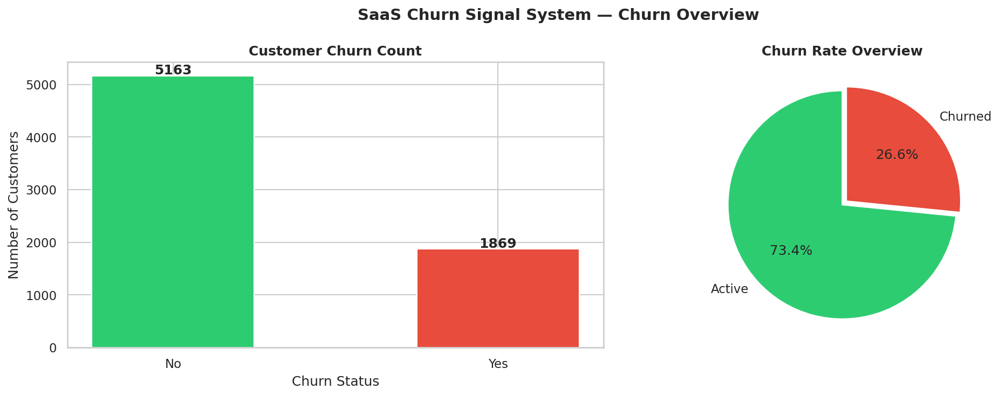
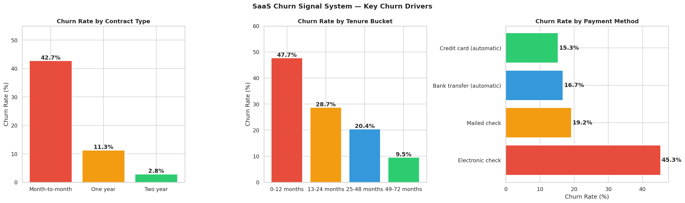
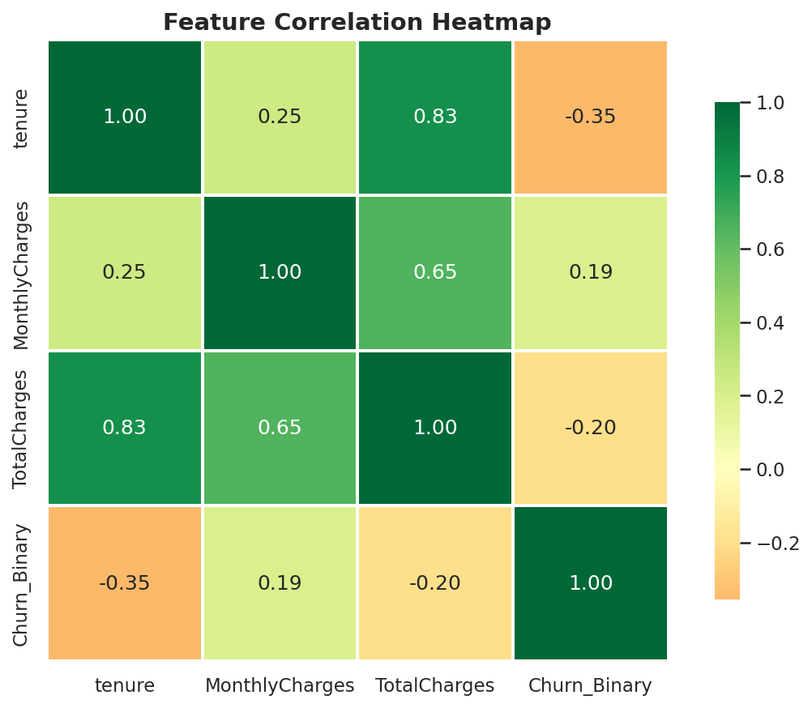

# SaaS Churn Signal System

> Predicting customer churn before it happens — using SQL, Python, and Machine Learning

---

## Business Problem

For any SaaS business, a 5% increase in retention can increase profits by 
25–95% (Bain & Company). Yet most companies only notice churn after it 
happens.

This project answers three questions:
- **Who** is about to churn?
- **When** are they most likely to leave?
- **Why** — which factors drive their decision?

---

## Key Findings

| Insight | Business Impact |
|---|---|
| 26.54% overall churn rate | 1 in 4 customers is leaving |
| Month-to-month churn = 42.7% | 15x higher than two-year contracts |
| Churned customers paid $74.44/mo avg | We are losing HIGH value customers |
| 871 customers flagged High Risk | $138.88K MRR immediately at risk |
| Fiber optic churn = 41.89% | Product quality issue for top-tier users |
| First 12 months = highest risk | Onboarding experience needs urgent fix |

---

## Project Architecture
```
Raw CSV → PostgreSQL → Python EDA → ML Model → Power BI Dashboard
```

---

## Tech Stack

| Tool | Purpose |
|---|---|
| PostgreSQL + pgAdmin | Data storage + SQL analysis |
| Python + Pandas | Data cleaning + EDA |
| Scikit-learn | Churn prediction model (Random Forest) |
| Lifelines | Kaplan-Meier survival analysis |
| SHAP | Model explainability |
| Power BI | 3-page interactive dashboard |

---


---

## Dashboard Preview

### Page 1 — Executive Overview
](DashboardGif/overview1.gif)

### Page 2 — Churn Deep Dive
](DashboardGif/deepdive.gif)

### Page 3 — Customer Risk Monitor
](DashboardGif/customerAtRisk.gif)

---

## Model Performance

| Model | AUC-ROC |
|---|---|
| Logistic Regression | ~0.84 |
| Random Forest | ~0.86 |

Random Forest selected as final model. SHAP values used to explain 
individual predictions — top drivers: Contract type, Tenure, 
Internet Service type.

---

## Dataset

**Source:** IBM Telco Customer Churn (Kaggle)
**Rows:** 7,043 customers · **Columns:** 21 features
**Note:** Telecom dataset used as SaaS proxy. Column mappings:
MonthlyCharges → MRR, tenure → customer age, Contract → subscription plan

---

## Author

**Seenu** — Data Analyst Portfolio Project
Built to demonstrate end-to-end data analytics capability:
SQL → Python → Machine Learning → Business Storytelling